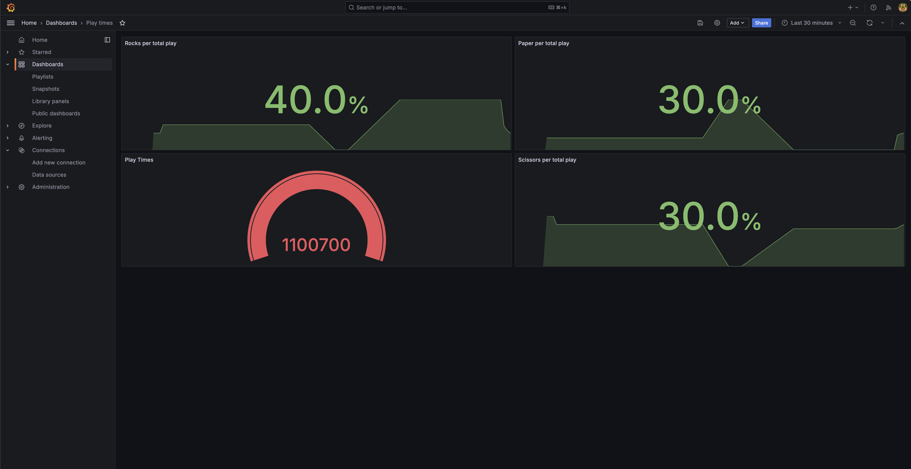

## Introduction
Simple Demonstrate Prometheus with UI Grafana and metrics from Express Nodejs

## Technologies
1. Express Nodejs
2. prom-client npm
3. Grafana (UI)
4. Prometheus (Metric collector)

## How to run

1. Run command
```bash
docker-compose up -d
```
2. Access Rock Paper Scissors page to collect metrics http://localhost:3001/play?times=1000000
3. Access Grafana http://localhost:3000 (User: admin, Password: grafana)


